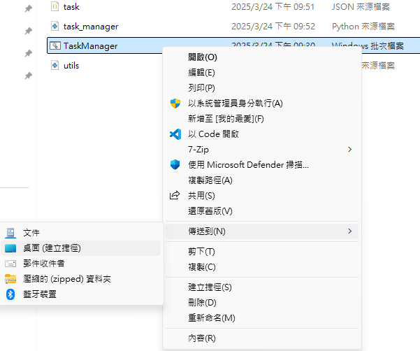

# Simple Task Manager

A simple task manager that allows users to add, mark, and delete tasks. 

## Usage

1. Download the lastest release from the [releases page](https://github.com/omei-ogami/simple-progress-dashboard/releases) or clone the repository.
2. Modify `TaskManager.bat` to the path of the folder.
    ```bash
    cd "D:\Path\to\this\folder"
    ```
3. Run `TaskManager.bat` to start the task manager.
4. Optional: add to the desktop for easy access.


**Note**: The task manager will open the terminal and run in the browser window. **Don't** close the terminal when you are using the task manager.

---

## Functions
- Add & save tasks
- Mark tasks as completed
- Delete tasks
- Sort tasks by remaining days

## Future Features
- Add subtasks
- More detailed task information
- Reminder

---

